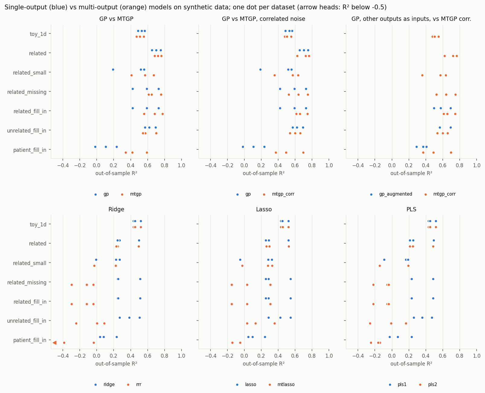

# multitask: multi-output vs single-output regression

The question here is:

> For a regression problem with several outputs (e.g. several language scores per patient), does one
> joint **multi-output** model predict better than a separate **single-output** model per output?

The package fits matched pairs of models, cross-validates them on identical folds, and says whether
the difference is larger than chance. It also includes feature selection (forward
selection), PCA front ends for high-dimensional (e.g., brain data) inputs, and a synthetic
benchmark that shows when multi-output models help.

```
pip install -e .          # numpy, scipy, pandas, scikit-learn, matplotlib, joblib
pytest                    # 42 tests on synthetic data, ~1 minute

python -m multitask compare data.csv --inputs age lesion_vol time --outputs naming reading repetition \
       --models gp mtgp mtgp_corr ridge rrr --k 10 --mode fill_in --out results/
python -m multitask benchmark --datasets 3 --k 5 --jobs 4 --out benchmark/
```

```python
from multitask.evaluation import cross_validate
res = cross_validate(["gp", "mtgp"], X, Y, k=10)      # Y may contain NaN
res.scores()                                         # r, R2, MAE, RMSE, NLL per model x output
res.compare("gp", "mtgp")                            # MSE difference, bootstrap CI, verdict
```

## The models

| single-output | multi-output | what the multi-output model shares |
|---|---|---|
| `gp`: one ARD GP per output | `mtgp`: multi-task GP (Bonilla ICM, the MTGP toolbox model) | a between-output covariance B; one set of length scales |
| `gp` | `mtgp_corr`: mtgp with correlated noise | also noise that a patient's outputs share (e.g. overall severity) |
| `gp` | `lmc`: 2 latent functions (LMC) | several shared processes with their own smoothness (stands in for multigp's convolution kernels) |
| `gp_augmented`: per-output GP that also takes the other outputs as inputs | `mtgp`, `mtgp_corr` | (the strong single-output baseline for fill-in) |
| `ridge` | `rrr`: reduced-rank ridge | a low-rank coefficient matrix |
| `lasso` | `mtlasso`: L2,1 multi-task lasso (MALSAR's `Least_L21`) | the selected features |
| `pls1` | `pls2` | latent components |
| `pca_gp` | `pca_mtgp` | PCA of the inputs, fitted inside each fold |

Also `peak_voxel` (regression on the most correlated feature). Penalties, ranks and numbers of
components are all chosen by inner cross-validation.

**Two prediction modes.**

- `from_inputs`: predict all of a new participant's outputs from their inputs.
- `fill_in`: predict each output from the inputs *plus the participant's other outputs* (each one hidden in turn). i.e., we are catering to panel data here

Multi-output GPs can use those other outputs by conditioning on them, without refitting. The linear
models cannot, so `gp_augmented` is included as the fair single-output competitor.

**Missing outputs.** The GPs fit on whatever (patient, output) pairs are observed. The joint linear
models (`rrr`, `mtlasso`, `pls2`) need complete rows, so they drop incomplete ones.

## Making the comparison fair

- **Same folds for every model** (a paired design). `compare()` bootstraps patients on the paired
  squared-error differences, per output and pooled; the pooled figure scales each output by its variance.
- **Scaling and PCA happen inside the folds.** The original code z-scored and ran PCA on all patients first.
- **No hyperparameter prior for either GP.** A N(0,1) prior on the log-hyperparameters (the
  original default) penalises a single-output GP much more than a multi-output one, because the
  single-output GP has less data to overcome it. In testing this dropped a single GP's r from
  0.90 to 0.73, which made multi-output models look better than they are. `prior_var=None` is now
  the default for both.

## What the benchmark shows

Synthetic data from `synthetic.shared_factors`, with 3 datasets per scenario and 5-fold CV.
Full results are in `benchmark/`.

| scenario | gp | mtgp | mtgp_corr | gp_augmented | ridge | rrr | lasso | mtlasso | pls1 | pls2 |
|---|---|---|---|---|---|---|---|---|---|---|
| toy_1d (original test problem) | .53 | .51 | .51 | | .47 | .47 | .47 | .47 | .47 | .47 |
| related (n=150) | .70 | .72 | .70 | | .34 | .33 | .35 | .36 | .32 | .32 |
| related_small (n=60) | .42 | **.55** | .52 | | .16 | .14 | .19 | .20 | .09 | .08 |
| related_missing (40% missing) | .58 | **.67** | .64 | | .34 | −.15 | .36 | .06 | .31 | −.10 |
| related_fill_in | .58 | **.67** | **.67** | .59 | .34 | −.15 | .36 | .06 | .31 | −.10 |
| unrelated_fill_in | .63 | .61 | .60 | .61 | .39 | −.05 | .42 | .17 | .36 | −.04 |
| patient_fill_in (shared patient factor) | .11 | .45 | **.52** | .36 | .12 | −.55 | .13 | −.11 | .09 | −.18 |

(mean out-of-sample R²)



**When a multi-output GP helps.**

- **When outputs are related and data are scarce or incomplete.** The MTGP beat independent GPs
  by 0.09–0.13 in pooled variance-scaled MSE. Differences were significant in 2 of 3 datasets for
  related_small and related_missing, and 3 of 3 for related_fill_in.
- **With plenty of complete data, the gain is small** (+0.02, significant in 1 of 3 datasets).
- **Fill-in helps only when participants share variation the inputs don't explain.** With a
  patient-level factor in the data, `mtgp_corr` gained 0.35 over independent GPs (3 of 3
  datasets) and 0.16 over `gp_augmented` (2 of 3). Without such a factor, fill-in added nothing
  over predicting from inputs (0.672 vs 0.673).
- **When outputs are unrelated, it costs a little** (−0.02, not significant at n=150). At n=100
  the single-latent `mtgp` lost more (R² 0.53 vs 0.68), because every output must use the same
  length scales. The 2-latent `lmc` lost only 0.04. If outputs may depend on different inputs,
  use `lmc`.

**The joint linear models were no better than their single-output versions,** even with fully
observed related outputs (differences within ±0.03). With missing outputs they were much worse
(0.24 to 0.47 lower), because they discard every incomplete patient.

## Feature selection (`selection.py`)

`ard_rankings` ranks features for each output by ARD relevance. `forward_selection` reimplements
MultiGP.m / MultiGP_MassiveParallel.m: at each step, try the next unused feature from each
output's ranking and keep the best one.

`size_scan` reimplements PLORAS_MultiGP_V2.m. `nested` repeats the whole selection inside an outer
cross-validation, because a selection's own CV score is optimistic.

## Layout

```
multitask/
  mtgp.py         MultiTaskGP (ICM/LMC, correlated noise, missing outputs, predict_given), predict_trajectory
  gp.py           GaussianProcess, SingleOutputGPs
  linear.py       ridge/RRR, lasso/multi-task lasso, PLS1/PLS2, AugmentedSingle
  models.py       every model by name; single/multi pairs
  evaluation.py   folds, cross_validate (parallel), CVResults.scores / compare
  selection.py    ARD rankings, forward selection, size scan, nested selection
  brain.py        PCA front end, peak-voxel model, direction accuracy
  synthetic.py    toy_1d, shared_factors (optional patient factor), lmc_sample, mask_missing
  benchmark.py    synthetic scenarios, summary, figure
tests/            synthetic-data tests
benchmark/        benchmark results and figure
```

**Caveats.**
- The GP models scale as O((participants × outputs)³). A few hundred participants with a handful of outputs is fine; thousands would need a sparse approximation.
- The benchmark uses synthetic data generated to have known structure. Whether real outputs share enough to benefit is exactly what `compare` on your own data answers.
